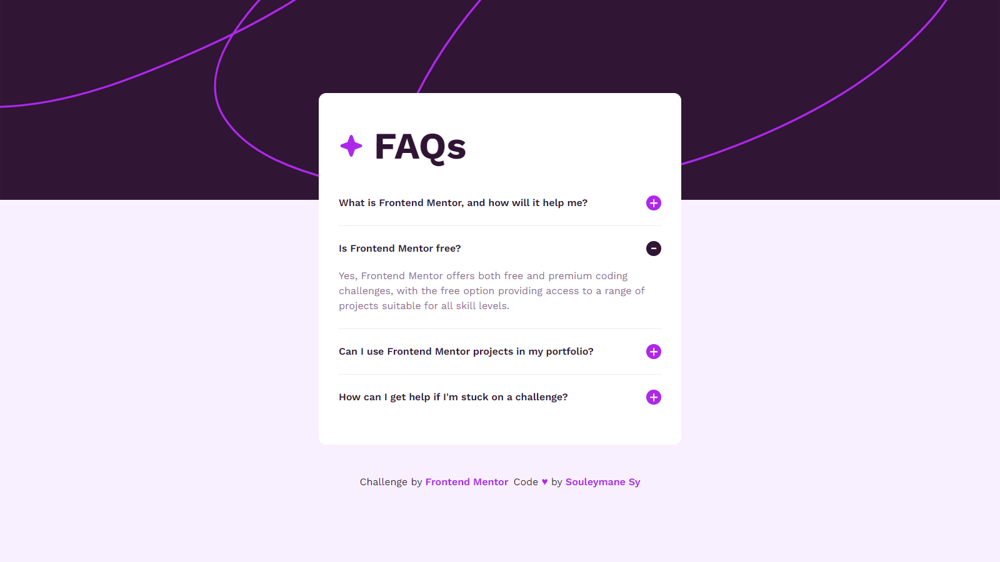

# Frontend Mentor - FAQ accordion


## Welcome! 👋

This is a solution to the [FAQ accordion challenge on Frontend Mentor](https://www.frontendmentor.io/challenges/faq-accordion-wyfFdeBwBz). Frontend Mentor challenges help you improve your coding skills by building realistic projects.

## Table of contents

- [Links](#links)
- [The Challenge](#the-challenge)
- [UI Screenshots](#ui-screenshots)
- [Built With](#built-with)
- [How To Use This Repos](#how-to-use-this-repos)
- [Author](#author)

## Links

- Solution URL: [Frontend Mentor Solution](https://www.frontendmentor.io/solutions/faq-accordion-made-with-react-typescript-and-tailwind-css-geuq0_ViuL)
- Live Site Demo URL: [Demo Live]([https://your-live-site-url.com](https://fem-accordion-ten.vercel.app/))

## The challenge

The challenge is to build out this FAQ accordion and get it looking as close to the design as possible.

Your users should be able to:

- Hide/Show the answer to a question when the question is clicked
- Navigate the questions and hide/show answers using keyboard navigation alone
- View the optimal layout for the interface depending on their device's screen size
- See hover and focus states for all interactive elements on the page

## UI ScreenShots

### Mobile


### Desktop



## Built with

- Semantic HTML5 markup
- CSS custom properties
- Flexbox
- Mobile-first workflow
- [Vite Js](https://vitejs.dev/) Javascript Bundler.
- [PNPM](https://pnpm.io/) Package Manager.
- [React Js](https://react.dev/) UI Library.
- [Typescript](https://typescript) - A typed language, builds on top of javascript.
- [Tailwind CSS](https://axios-http.com/) A utility-first CSS framework.

## How To Use This Repos

To clone and run this application, you'll need [Git](https://git-scm.com) and [PNPM](http://pnpm.io/) installed on your computer. From your command line:

```bash
# Clone this repository
$ git clone https://github.com/SouleymaneSy7/fem-accordion

# Install dependencies
$ pnpm install

# start the server
$ pnpm dev
```

## Author

- GitHub - [Souleymane Sy](https://github.com/SouleymaneSy7)
- Frontend Mentor - [@SouleymaneSy7](https://www.frontendmentor.io/profile/SouleymaneSy7)
- Dev Challenges - [Souleymane Sy](https://devchallenges.io/profile/534cd213-3165-4c16-bdcf-058e1f468da0)
- Twitter - [@Souleymanesy43](https://twitter.com/Souleymanesy43)
